# TaskFlow — Student Task Management System

## Student Information
- **Name:** Kimberly Marimla
- **Section:** BSCS 3A
- **Subject:** Software Engineering 1
- **Module:** Module 7 - Design and Implementation
- **Instructor:** Patrick Jason L. Torres

## System Description
**TaskFlow** is a modern, pastel-themed student task management dashboard designed to help students organize and manage their academic tasks, assignments, quizzes, projects, and deadlines. This Module 7 prototype focuses on the **Tasks** entity, providing an intuitive and visually appealing interface for creating, viewing, editing, deleting, and searching tasks directly in the browser.

## Selected Module 6 Entity
**Entity:** Tasks

This prototype implements the `tasks` collection from the Module 6 architectural design. The following fields are included:
- **Title** - Name of the task
- **Subject** - Course or subject related to the task
- **Due Date** - Deadline for the task
- **Priority** - High, Medium, or Low
- **Status** - Pending, In Progress, or Completed
- **Description** - Additional details about the task

## Implemented Features
- Dashboard with statistics cards (Total, Pending, Completed, High Priority)
- Task progress ring with completion percentage
- Upcoming tasks and recent tasks sections
- Calendar overview with task due dates
- Motivational quotes that rotate daily
- Add, edit, delete tasks with modal form
- Mark tasks as completed with checkbox toggle
- Search tasks by title or subject
- Filter tasks by priority and status
- Form validation for required fields
- Success and error feedback messages
- Light/Dark mode toggle with persistent theme
- Sidebar navigation with status filters
- Data persistence using browser localStorage
- Fully responsive design for desktop, tablet, and mobile
- Sample student tasks pre-loaded for demonstration

## Technologies Used
- **Vue.js 3** - Frontend framework with Composition API
- **Vite** - Build tool and development server
- **JavaScript** - Application logic and CRUD operations
- **Tailwind CSS v4** - Utility-first CSS framework for styling
- **localStorage** - Browser-based data persistence
- **Git & GitHub** - Version control and repository hosting
- **GitHub Actions** - Continuous integration build check

## Installation and Run Instructions

### Prerequisites
Make sure you have the following installed:
- Node.js (version 18 or higher)
- npm (comes with Node.js)
- Git

### Steps

1. **Clone or extract the project:**
   ```bash
   cd marimla-module7-vue-system
   ```

2. **Install dependencies:**
   ```bash
   npm install
   ```

3. **Run the development server:**
   ```bash
   npm run dev
   ```

4. **Open your browser and go to:**
   ```
   http://localhost:5173/
   ```

5. **Build for production:**
   ```bash
   npm run build
   ```

## Explanation of localStorage

This prototype uses the browser's **localStorage** to persist task data and theme preference. When a task is added, edited, or deleted, the entire task list is saved to localStorage as a JSON string under the key `module7-tasks`. The theme preference (light/dark) is saved under `taskflow-theme`. When the page is loaded or refreshed, the application reads this data from localStorage and restores the task list and theme. This allows records to remain available even after closing and reopening the browser.

**Note:** localStorage is limited to the current browser and device. It is used here only for prototype demonstration purposes. In the full system (Module 6 architecture), data will be stored in MongoDB Atlas with a proper backend API.

## Connection Between Module 6 and Module 7

| Module 6 Element | Module 7 Implementation |
|------------------|------------------------|
| Proposed complete system (Student Task Management System) | Basis and long-term blueprint |
| Presentation Layer (Vue.js) | Vue components with pastel theme and Tailwind CSS |
| System module/entity (Tasks) | Task CRUD prototype with dashboard statistics |
| User interactions | Forms, modals, cards, search, filters, and calendar |
| Application logic | JavaScript CRUD, validation, and search functions |
| Data Layer (MongoDB Atlas) | Simulated using browser localStorage |
| Backend/API (Node.js & Express) | Future implementation; not required now |

## Vue Component Structure

```
src/
├── components/
│   ├── AppHeader.vue      # Top navigation bar with search and theme toggle
│   ├── Sidebar.vue        # Side navigation with status filters
│   ├── Dashboard.vue      # Main dashboard with stats, upcoming, recent, progress
│   ├── TaskList.vue       # Full task list with search and filters
│   ├── TaskCard.vue       # Reusable individual task card
│   ├── TaskForm.vue       # Modal form for add/edit tasks
│   ├── Calendar.vue       # Monthly calendar with task dots
│   └── AppFooter.vue      # Footer with student info
├── App.vue                # Main layout and state management
├── main.js                # App entry point
└── style.css              # Pastel theme with light/dark mode
```

## Application Screenshots

*Screenshots should be placed in a `screenshots/` folder and referenced here.*

### 01 - Running Application
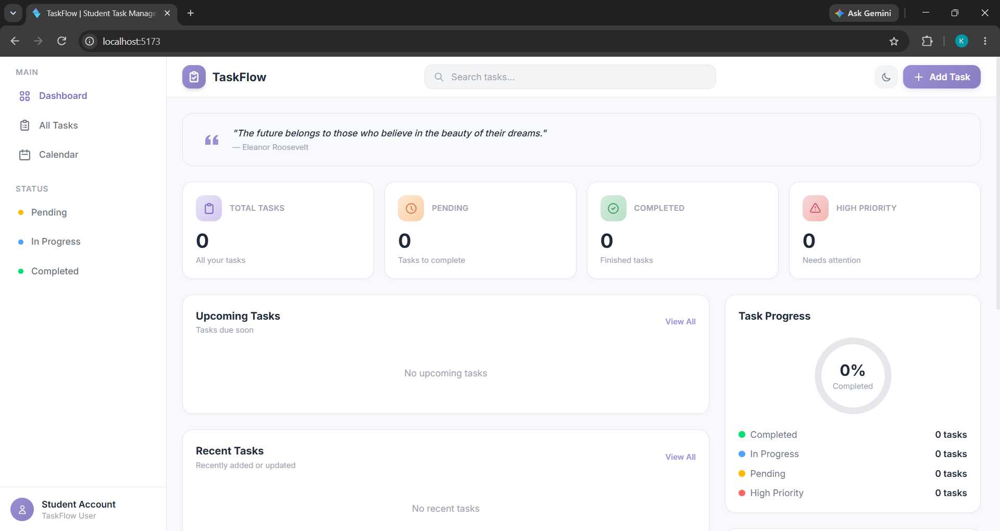

### 02 - Add Record
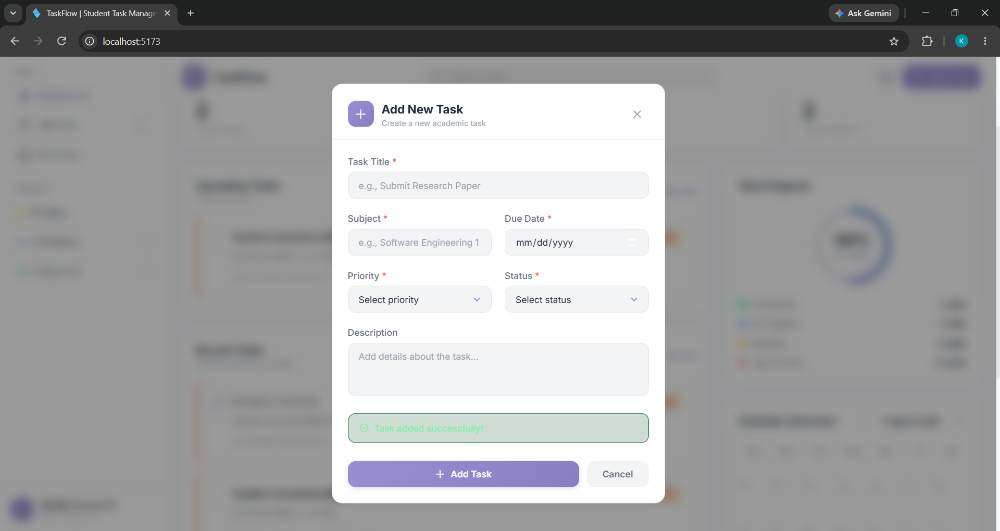

### 03 - Record List
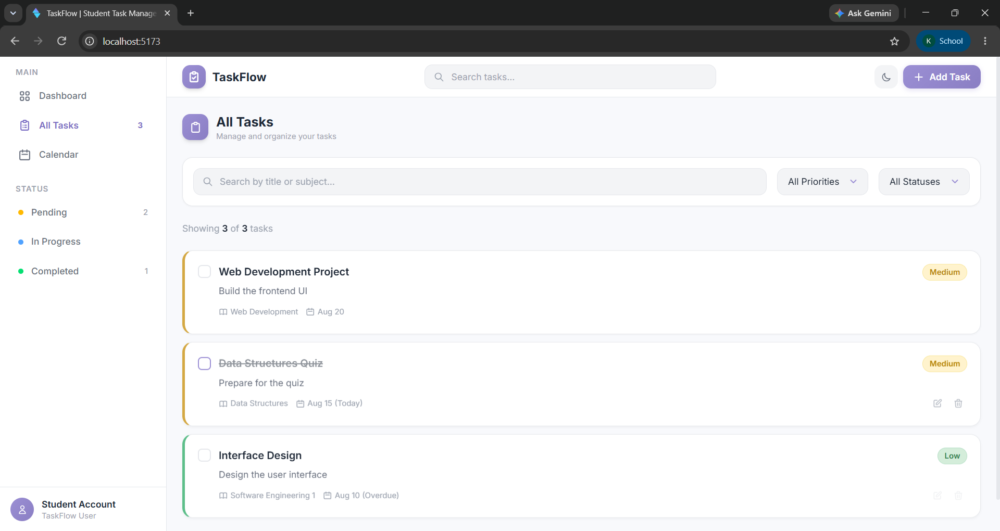

### 04 - Edit Record
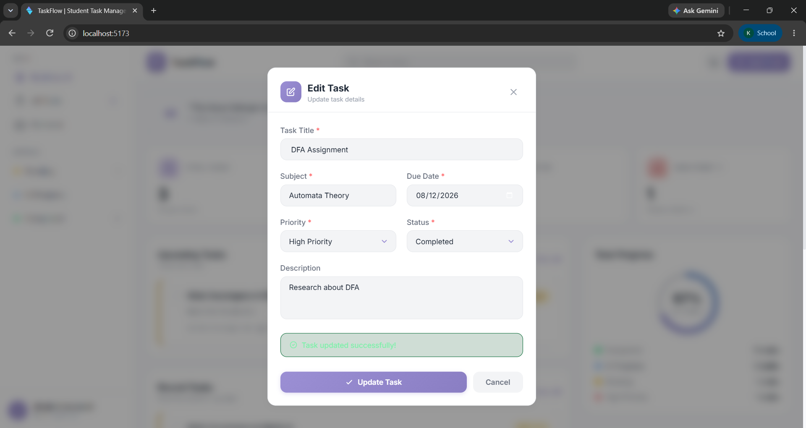

### 05 - Delete Confirmation
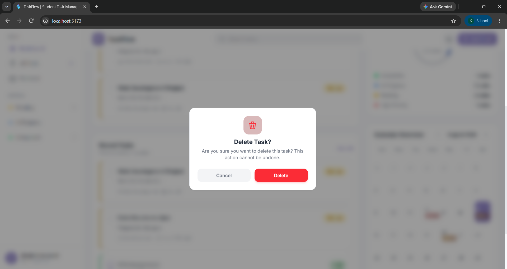

### 06 - Search Function
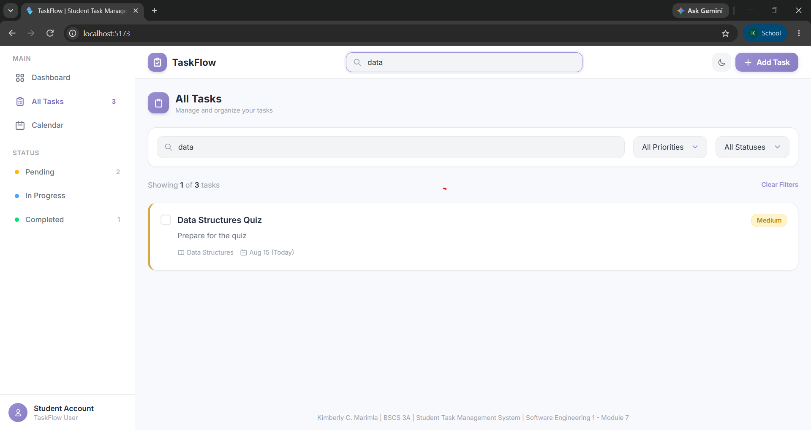

### 07 - localStorage
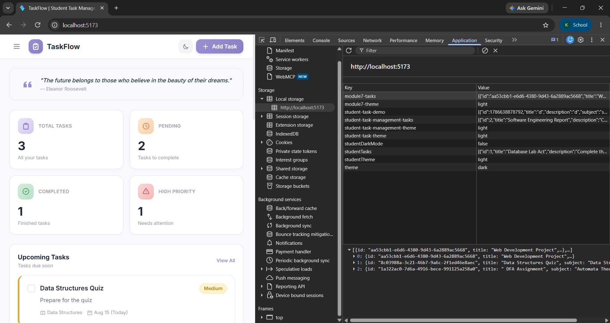

### 08 - Responsive View
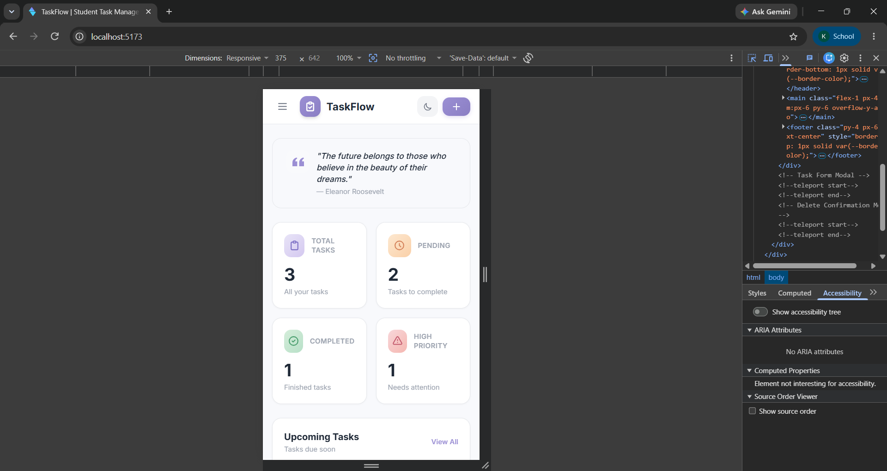

### 09 - GitHub Repository
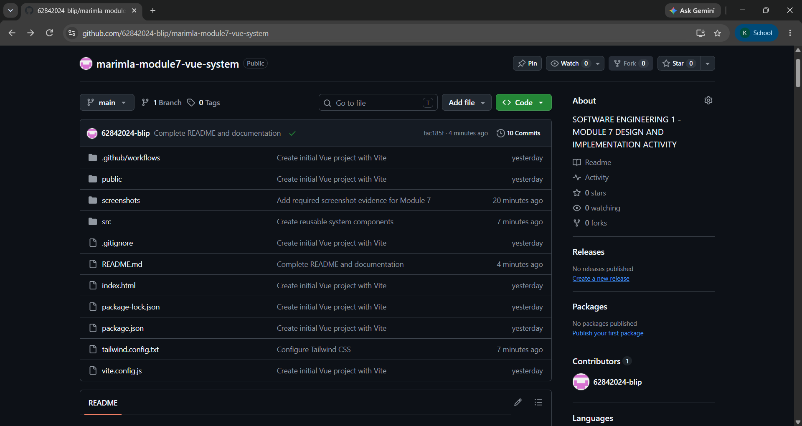

### 10 - Commit History
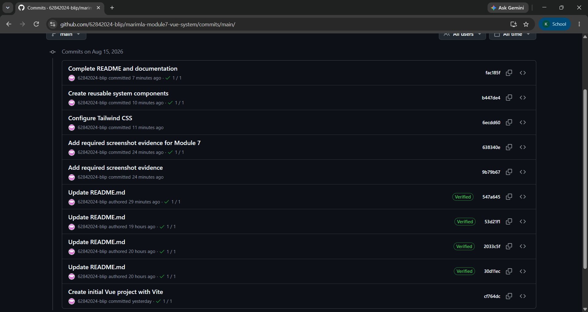

### 11 - CI Success
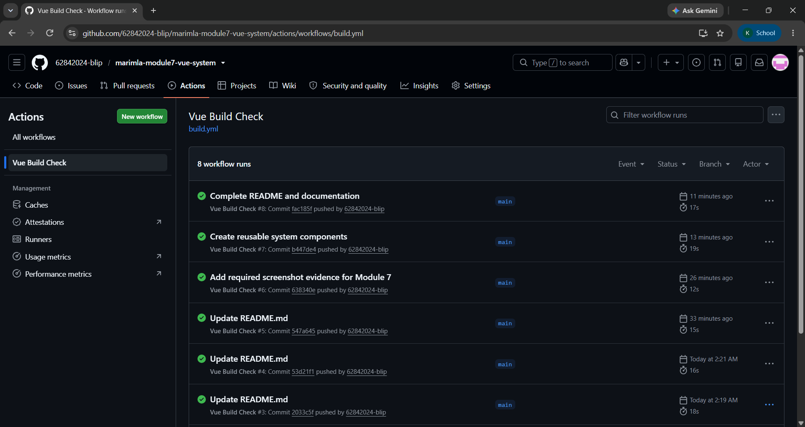

## Known Limitations
- Data is stored only in the browser's localStorage and is not shared across devices or browsers.
- No user authentication; all tasks are stored locally without user accounts.
- No backend API or database connection; this is a frontend-only prototype.
- No due date reminders or notifications.
- Calendar is a simplified month view without full event details.

## Proposed Future Improvements
- Connect to the Node.js and Express backend from Module 6.
- Implement MongoDB Atlas for persistent cloud storage.
- Add user authentication and individual user accounts.
- Implement task categories and tags.
- Add due date reminders and email notifications.
- Enable drag-and-drop task prioritization.
- Add a full calendar with event details.
- Implement task sharing between students.

## GitHub Repository
[https://github.com/YOUR_USERNAME/marimla-module7-vue-system](https://github.com/YOUR_USERNAME/marimla-module7-vue-system)

*(Replace with your actual public repository URL)*
