# Student Task Management System

## Student Information
- **Name:** Kimberly Marimla
- **Section:** BSCS 3A
- **Subject:** Software Engineering 1
- **Module:** Module 7 - Design and Implementation
- **Instructor:** Patrick Jason L. Torres

## System Description
**TaskFlow** is a modern, pastel-themed student task management dashboard designed to help students organize and manage their academic tasks, assignments, quizzes, projects, and deadlines. This Module 7 prototype focuses on the **Tasks** entity, providing an intuitive and visually appealing interface for creating, viewing, editing, deleting, and searching tasks directly in the browser.

## Selected Module 6 Entity
**Entity:** Tasks

This prototype implements the `tasks` collection from the Module 6 architectural design. The following fields are included:
- **Title** - Name of the task
- **Subject** - Course or subject related to the task
- **Due Date** - Deadline for the task
- **Priority** - High, Medium, or Low
- **Status** - Pending, In Progress, or Completed
- **Description** - Additional details about the task

## Implemented Features
- Dashboard with statistics cards (Total, Pending, Completed, High Priority)
- Task progress ring with completion percentage
- Upcoming tasks and recent tasks sections
- Calendar overview with task due dates
- Motivational quotes that rotate daily
- Add, edit, delete tasks with modal form
- Mark tasks as completed with checkbox toggle
- Search tasks by title or subject
- Filter tasks by priority and status
- Form validation for required fields
- Success and error feedback messages
- Light/Dark mode toggle with persistent theme
- Sidebar navigation with status filters
- Data persistence using browser localStorage
- Fully responsive design for desktop, tablet, and mobile
- Sample student tasks pre-loaded for demonstration

## Technologies Used
- **Vue.js 3** - Frontend framework with Composition API
- **Vite** - Build tool and development server
- **JavaScript** - Application logic and CRUD operations
- **Tailwind CSS v4** - Utility-first CSS framework for styling
- **localStorage** - Browser-based data persistence
- **Git & GitHub** - Version control and repository hosting
- **GitHub Actions** - Continuous integration build check

## Installation and Run Instructions

### Prerequisites
Make sure you have the following installed:
- Node.js (version 18 or higher)
- npm (comes with Node.js)
- Git

### Steps

1. **Clone or extract the project:**
   ```bash
   cd marimla-module7-vue-system
   ```

2. **Install dependencies:**
   ```bash
   npm install
   ```

3. **Run the development server:**
   ```bash
   npm run dev
   ```

4. **Open your browser and go to:**
   ```
   http://localhost:5173/
   ```

5. **Build for production:**
   ```bash
   npm run build
   ```

## Explanation of localStorage

This prototype uses the browser's **localStorage** to persist task data and theme preference. When a task is added, edited, or deleted, the entire task list is saved to localStorage as a JSON string under the key `module7-tasks`. The theme preference (light/dark) is saved under `taskflow-theme`. When the page is loaded or refreshed, the application reads this data from localStorage and restores the task list and theme. This allows records to remain available even after closing and reopening the browser.

**Note:** localStorage is limited to the current browser and device. It is used here only for prototype demonstration purposes. In the full system (Module 6 architecture), data will be stored in MongoDB Atlas with a proper backend API.

## Connection Between Module 6 and Module 7

| Module 6 Element | Module 7 Implementation |
|------------------|------------------------|
| Proposed complete system (Student Task Management System) | Basis and long-term blueprint |
| Presentation Layer (Vue.js) | Vue components with pastel theme and Tailwind CSS |
| System module/entity (Tasks) | Task CRUD prototype with dashboard statistics |
| User interactions | Forms, modals, cards, search, filters, and calendar |
| Application logic | JavaScript CRUD, validation, and search functions |
| Data Layer (MongoDB Atlas) | Simulated using browser localStorage |
| Backend/API (Node.js & Express) | Future implementation; not required now |

## Vue Component Structure

```
src/
├── components/
│   ├── AppHeader.vue      # Top navigation bar with search and theme toggle
│   ├── Sidebar.vue        # Side navigation with status filters
│   ├── Dashboard.vue      # Main dashboard with stats, upcoming, recent, progress
│   ├── TaskList.vue       # Full task list with search and filters
│   ├── TaskCard.vue       # Reusable individual task card
│   ├── TaskForm.vue       # Modal form for add/edit tasks
│   ├── ConfirmModal.vue   # Custom delete confirmation modal
│   ├── Calendar.vue       # Monthly calendar with task names
│   └── AppFooter.vue      # Footer with system info
├── tests/
│   └── TaskManagement.test.js  # Automated Vitest unit tests
├── App.vue                # Main layout and state management
├── main.js                # App entry point
└── style.css              # Pastel theme with light/dark mode
```

## Application Screenshots

### 01 - Running Application


### 02 - Add Record


### 03 - Record List


### 04 - Edit Record


### 05 - Delete Confirmation


### 06 - Search Function


### 07 - localStorage


### 08 - Responsive View


### 09 - GitHub Repository


### 10 - Commit History


### 11 - CI Success


## Known Limitations
- Data is stored only in the browser's localStorage and is not shared across devices or browsers.
- No user authentication; all tasks are stored locally without user accounts.
- No backend API or database connection; this is a frontend-only prototype.
- No due date reminders or notifications.
- Calendar is a simplified month view without full event details.

## Proposed Future Improvements
- Connect to the Node.js and Express backend from Module 6.
- Implement MongoDB Atlas for persistent cloud storage.
- Add user authentication and individual user accounts.
- Implement task categories and tags.
- Add due date reminders and email notifications.
- Enable drag-and-drop task prioritization.
- Add a full calendar with event details.
- Implement task sharing between students.

## Module 8: Software Testing Summary

### Test Approach
- **Static Testing:** Code review of Vue components, validation logic, and search filters
- **Dynamic Testing:** Manual functional testing of CRUD operations, search, and responsive design
- **Automated Testing:** 7 unit tests using Vitest covering add, display, edit, delete, search, and defect regression

### Manual Test Cases
10 manual test cases were designed and executed covering:
- TC-01: Add valid task (Positive)
- TC-02: Reject missing title (Negative)
- TC-03: Reject spaces-only title (Edge)
- TC-04: Display multiple tasks (Positive)
- TC-05: Edit existing task (Positive)
- TC-06: Cancel delete (Negative)
- TC-07: Confirm delete (Positive)
- TC-08: Search existing task (Positive)
- TC-09: Search missing task (Negative)
- TC-10: Verify localStorage persistence (Positive)

**Result:** 10/10 manual test cases passed.

### Automated Unit Tests
6 automated tests were implemented in `src/tests/TaskManagement.test.js`:
1. adds a valid task
2. displays multiple tasks
3. edits an existing task
4. deletes a task
5. searches tasks by title or subject
6. trims whitespace in search queries (defect fix regression)

**Result:** 6/6 automated tests passed.

### Identified Defect (BUG-01)
- **Summary:** Search with surrounding whitespace returns "No tasks found" even when matching tasks exist
- **Root Cause:** Missing `.trim()` on search query in `TaskList.vue`
- **Fix:** Added `.trim()` to normalize search input before filtering
- **Status:** Fixed and verified through retesting and regression testing

### CI/CD Pipeline
The GitHub Actions workflow was updated to run automated tests before the production build:
```yaml
- run: npm ci
- run: npm run test:run
- run: npm run build
```

## Testing Screenshots

#### 01 - Existing Application
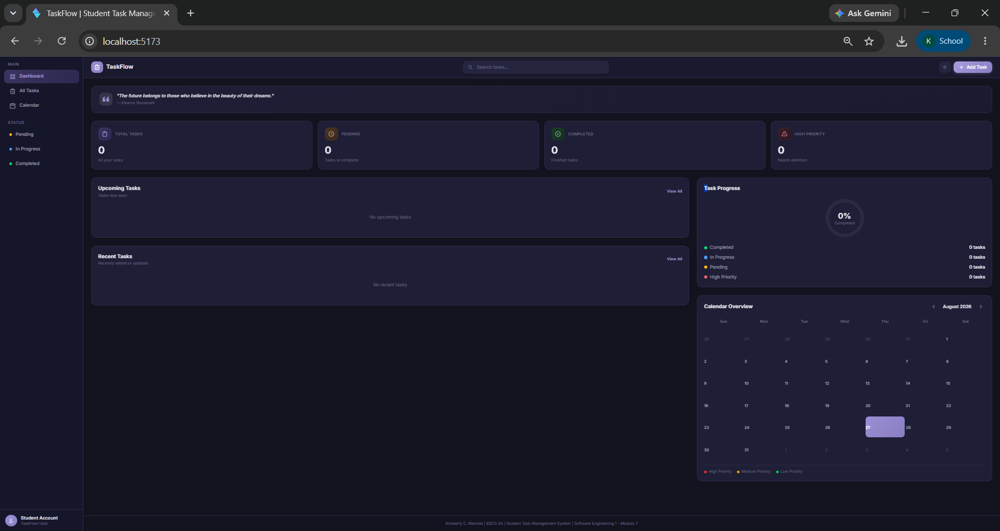

#### 02 - Passing Unit Tests
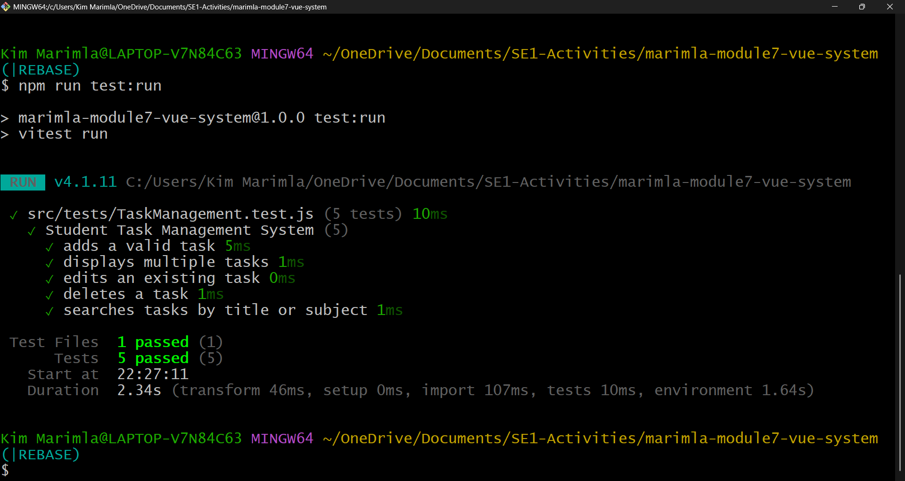

#### 03 - Failed Unit Test
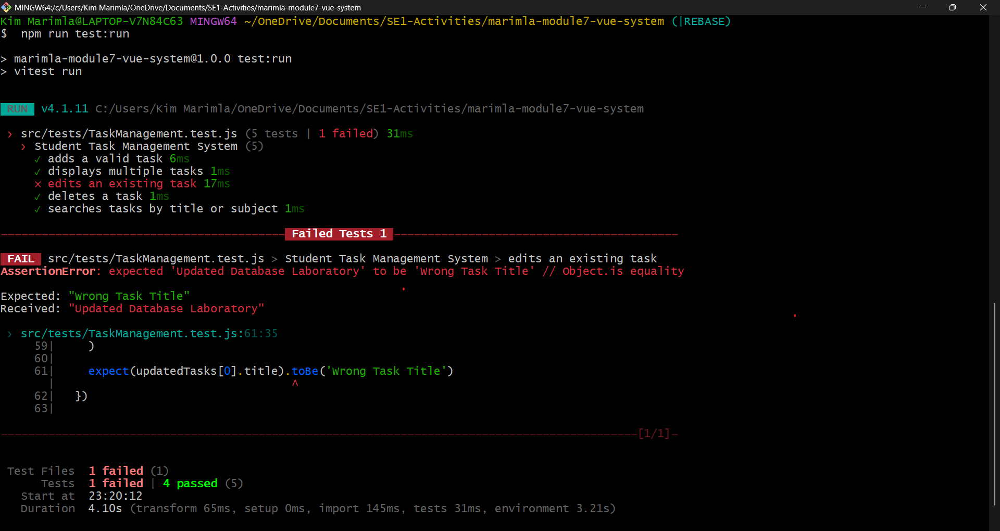

#### 04 - Identified Defect
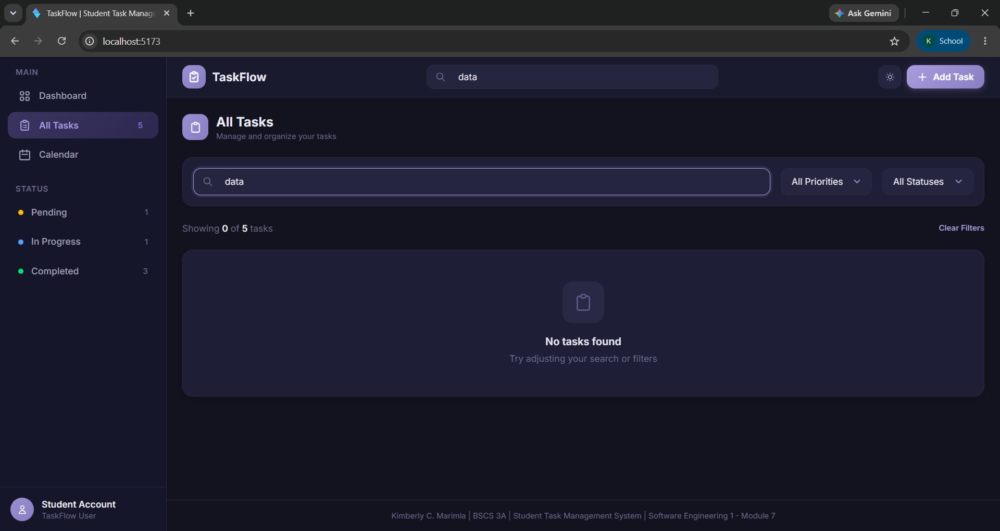

#### 05 - Defect Correction
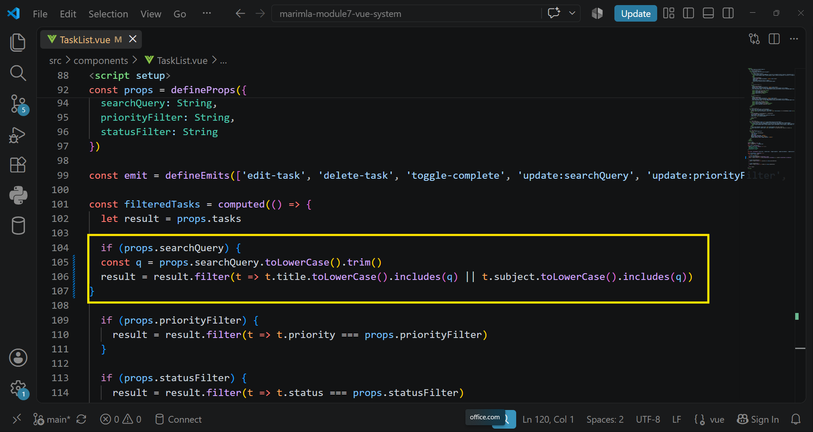

#### 06 - Successful Retesting
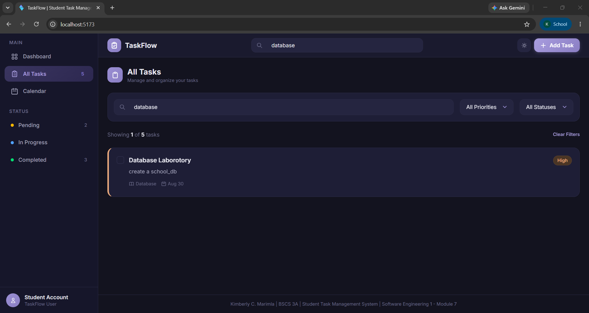

#### 07 - Final Regression Result
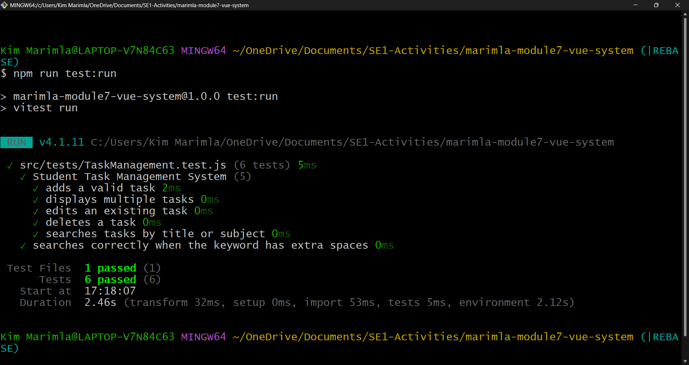

#### 08 - GitHub Commit
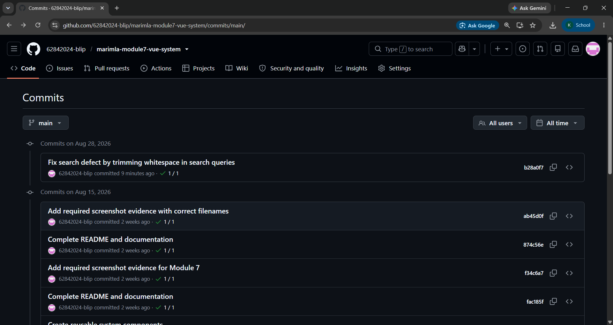


## Module 9 – Software Evolution

### Change Request

**CR-M9-01 – Add Overdue Option to the Status Filter**

**Maintenance Type:** Perfective Maintenance

**Target Version:** 1.1.0

The Student Task Management System was evolved by adding an **Overdue** option to the existing Status Filter. The system already identified overdue tasks in the task card display, but users could not directly filter the task list to show overdue tasks.

### Desired Outcome

Users can select **Overdue** from the Status Filter to display tasks whose due date has already passed while excluding completed tasks.

### Acceptance Criteria

- **AC-01:** The Status Filter provides an Overdue option alongside the existing status options.
- **AC-02:** Selecting Overdue displays tasks with a due date before the current date and a status other than Completed.
- **AC-03:** Completed tasks with past due dates are excluded from the Overdue results.
- **AC-04:** Existing CRUD, search, filtering, validation, delete confirmation, persistence, authentication, and responsive features remain functional.

### Affected Architecture

The change affects the existing task filtering flow in `TaskList.vue`.

The existing task data structure is preserved. No changes were made to the localStorage schema, authentication/session handling, or overall application architecture.

The Overdue condition is derived from existing task data:

**Due Date < Current Date AND Status != Completed**

### Implementation

The Status Filter in `TaskList.vue` was updated to include:

- Pending
- In Progress
- Completed
- Overdue

When Overdue is selected, the system checks each task's due date and status. Past-due incomplete tasks are displayed, while completed and future tasks are excluded.

### Testing

The existing Module 8 automated tests were retained.

Two additional Module 9 automated tests were added:

1. Verifies that the Overdue option exists in the Status Filter.
2. Verifies that overdue incomplete tasks are displayed while completed and future tasks are excluded.

Final automated test result:

**8 tests passed.**

### Manual Regression Testing

Manual regression testing covered:

- Add/Create Task
- Display Tasks
- Edit Task
- Delete Task
- Search
- Search with extra spaces
- Validation
- Delete confirmation
- Persistence
- Pending filter
- Completed filter
- Responsive layout
- Overdue filter

All manual regression tests passed.

### Build

The production build completed successfully using:

```bash
npm run build
CI

The project uses GitHub Actions to automatically run the test suite and production build.

The Module 9 branch will be pushed to GitHub for CI verification.
```
### Limitations

The Overdue filter is based on the current date and existing task due-date/status values. No notification or reminder system was added.

### Release Notes – Version 1.1.0

## Added

Overdue option to the Status Filter.
Filtering of overdue incomplete tasks.
Exclusion of completed overdue tasks.
Two automated tests covering the new behavior.

## Preserved

Existing task CRUD operations.
Search and existing filters.
Validation.
Delete confirmation.
localStorage persistence.
Authentication and session handling.
Responsive interface.


### Screenshots / Evidence

#### M9-01 – Previous Architecture

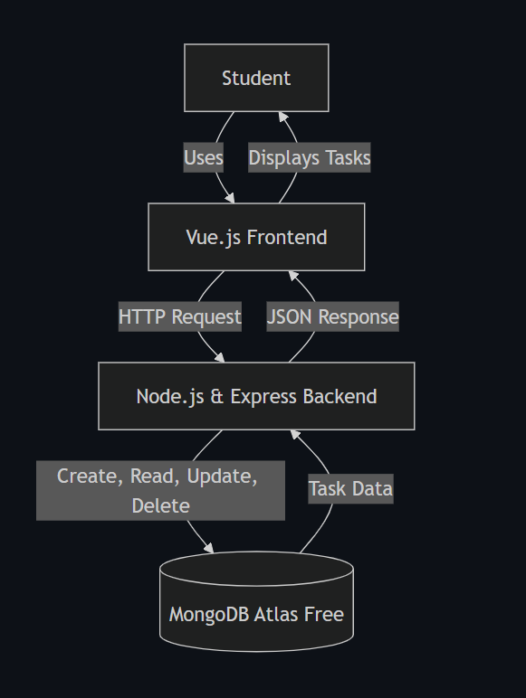

#### M9-02 – Existing System

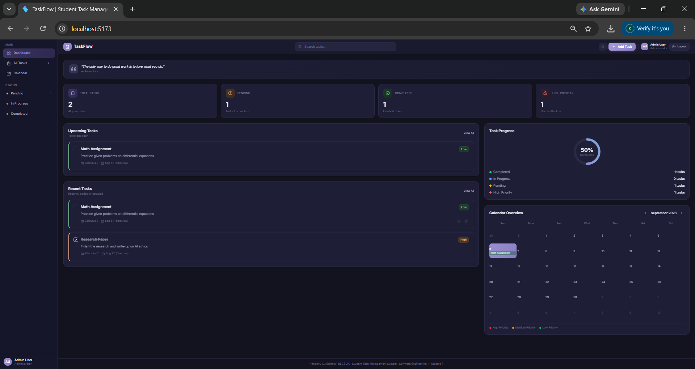

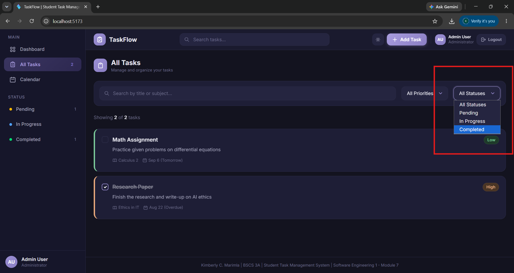

#### M9-03 – Module 8 Test Baseline

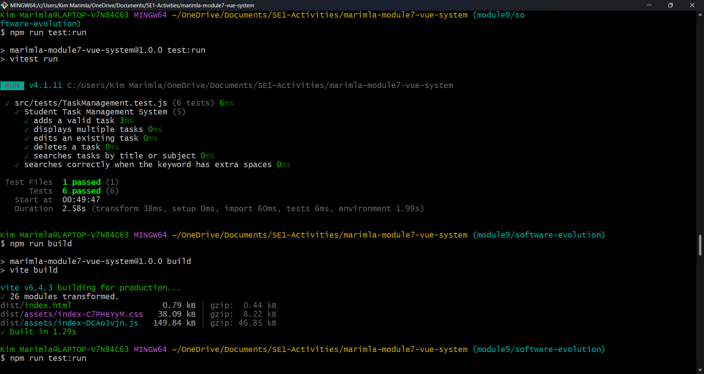

#### M9-04 – Change Request

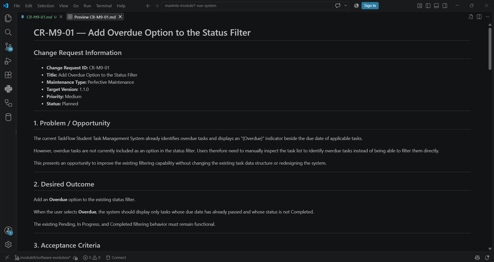

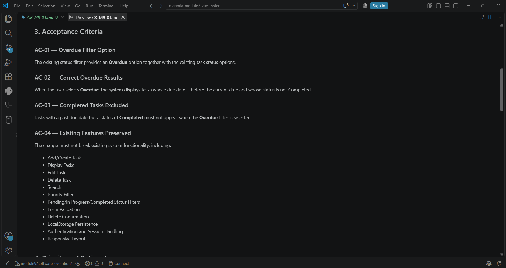

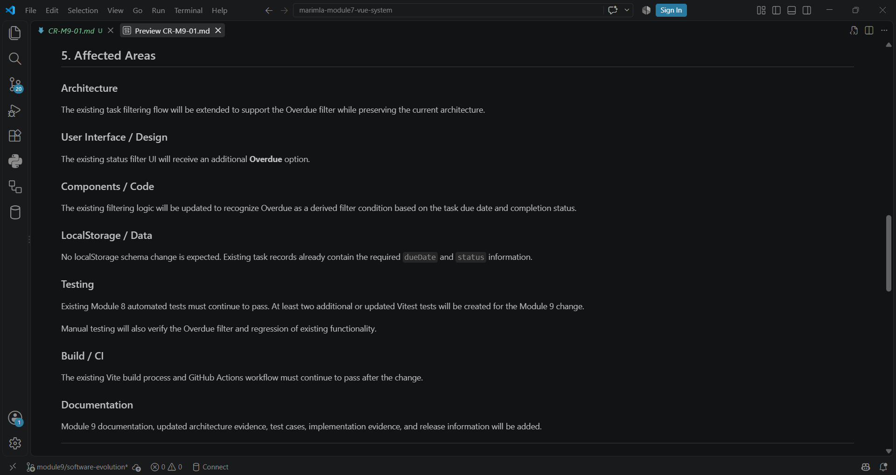

#### M9-05 – Updated Architecture

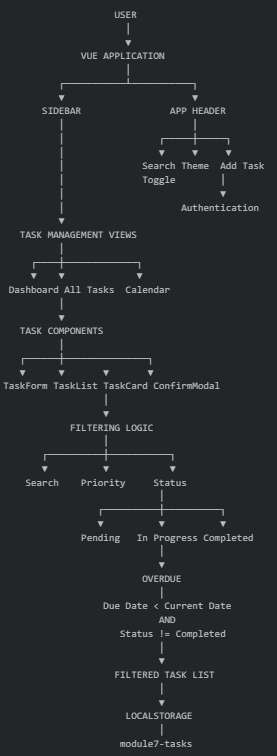

#### M9-06 – Implementation

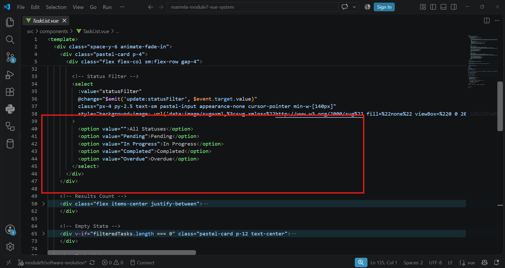

#### M9-07 – Evolved System

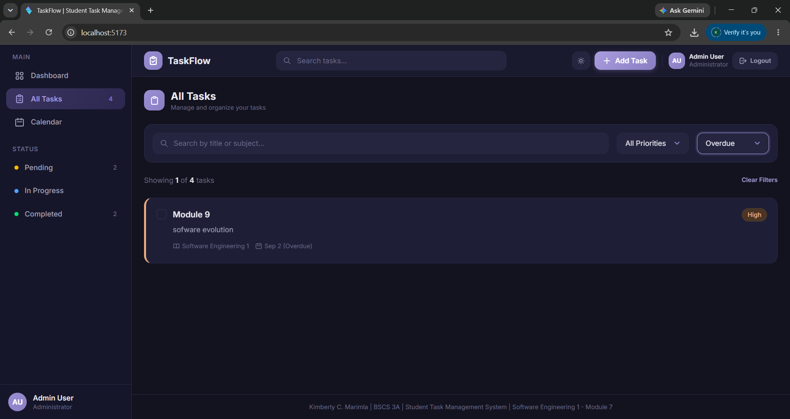

#### M9-08 – Updated Test Cases

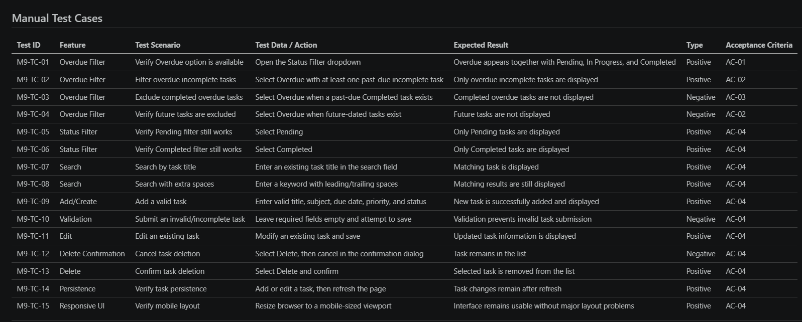

#### M9-09 – Test and Build Results

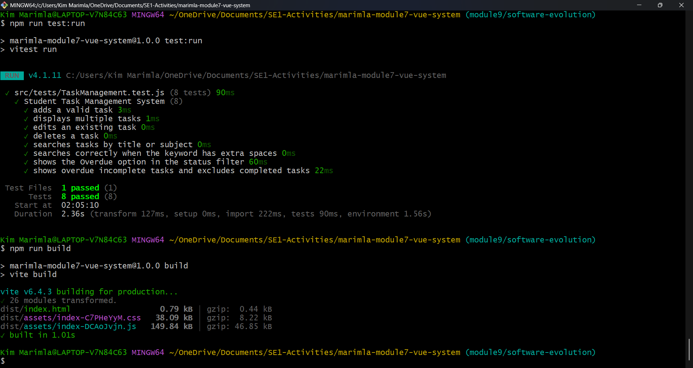

#### M9-10 – GitHub Actions

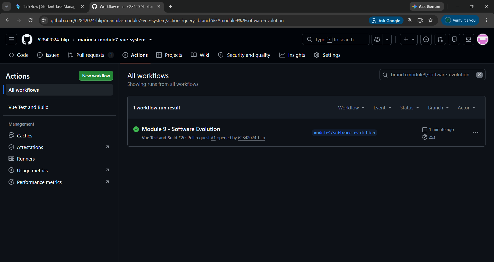

## GitHub Repository
[https://github.com/62842024-blip/marimla-module7-vue-system.git](https://github.com/62842024-blip/marimla-module7-vue-system.git)

## Live System
[https://62842024-blip.github.io/marimla-module7-vue-system/](https://62842024-blip.github.io/marimla-module7-vue-system/)

---
*Submitted for Software Engineering 1 - Module 7, 8, & 9*
